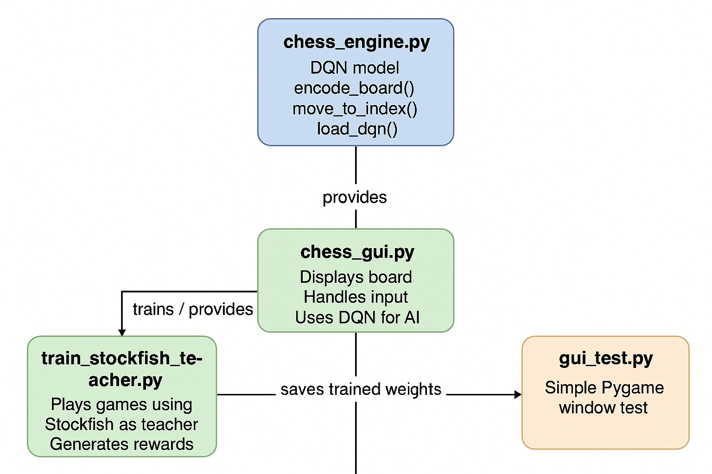

# DQNChess: Project Documentation

This document provides a comprehensive overview of the DQNChess project, from its core philosophy to the technical details of its implementation. It is intended to be a living document that evolves with the project.

## 1. Project Overview and Goals

The primary goal of DQNChess is to explore the application of Deep Q-Networks (DQN) to the game of chess. Unlike traditional chess engines that rely on brute-force search and handcrafted evaluation functions, this project aims to create an AI that learns to play chess through teacher-guided learning and strategic exploration.

### My Thought Process

As a 2000-rated chess player, I have always been fascinated by how chess engines truly operate. Popular engines such as Stockfish and AlphaZero are capable of defeating the world's best players, including Magnus Carlsen, with apparent effortlessness. This project serves to deepen my understanding of how these engines are constructed and function at their core.

I wanted to explore how a Deep Q-Network could become sufficiently strong to outperform the majority of chess players. My primary goal for this project is to create an agent capable of defeating 90% of the chess-playing population while simultaneously investigating the inherent limitations of DQN architecture when applied to a complex strategic game like chess.

This exploration combines my passion for chess with my interest in artificial intelligence, providing both practical experience in reinforcement learning and valuable insights into the computational approaches that have revolutionized modern chess.

---

## 2. Architecture Overview

The project is designed with a modular architecture, cleanly separating the core chess logic, AI model, training process, and user interface. This design philosophy enables independent experimentation with different components without affecting the overall system integrity.

*The flow diagram above illustrates the interaction between the main components of the DQNChess system.*

The main components are:

**`chess_engine.py`**: The core of the project, defining the DQN neural network architecture, encoding chess board states into network inputs, mapping moves to and from network output indices, and loading trained model weights.

**`train_stockfish_teacher.py`**: Implements teacher-guided training of the DQN chess agent using Stockfish as a reference, defining a reward function based on move quality, running an epsilon-greedy exploration policy, updating the network via episodes of gameplay, and periodically saving the trained model weights.

**`chess_gui.py`**: Implements a graphical interface for playing chess with a DQN agent, handling board rendering, piece display, player input via mouse clicks, and AI move selection using the trained DQN model.

**`gui_test.py`**: A simple Pygame script that creates a window, fills it with a color, and handles the basic quit event loop for testing the graphical environment.

---

## 3. Code Deep Dive

This section provides a detailed, function-by-function breakdown of the project's source code.

### `chess_engine.py`

This script contains the core components of the chess AI, including the board encoding logic and the DQN model itself.

-   **`encode_board(board)`**: Encodes a chess board state into a numerical representation for the neural network. The board is represented as a set of 12 binary "planes" (8x8), one for each piece type and color, which are then flattened into a single vector.
-   **`move_to_index(move)`**: Encodes a `chess.Move` object into a unique integer index. This is essential for mapping the DQN's output neurons to specific chess moves.
-   **`index_to_move(idx, board)`**: The inverse of `move_to_index`. It decodes an integer index back into a `chess.Move` object.
-   **`class DQN(nn.Module)`**: A simple Deep Q-Network with three fully connected layers. It takes the encoded board state as input and outputs Q-values for each possible move.
-   **`load_dqn(weights_file)`**: A helper function to load a pre-trained DQN model from a file. If no file is found, it initializes a new model with random weights.

### `train.py`

This script trains the DQN agent using a "teacher-student" learning approach with Stockfish as the teacher.

-   **`teacher_guided_move(board, stockfish, epsilon)`**: Selects a move using an epsilon-greedy strategy. With probability `(1 - epsilon)`, it chooses the best move suggested by Stockfish. With probability `epsilon`, it chooses a random legal move to encourage exploration. It also assigns a simple reward to the move.
-   **`main()`**: The main training loop. For each episode, it plays a game, collecting states, moves, and rewards. At the end of the episode, it uses this data to train the DQN in a supervised manner, teaching it to prefer the moves chosen by the teacher.

### `chess_gui.py`

This script implements a Pygame-based GUI for playing against the trained AI.

-   **`draw_board(win, selected_square)`**: Draws the chessboard squares.
-   **`draw_pieces(win, board)`**: Draws the pieces on the board using the loaded images.
-   **`main()`**: The main game loop. It handles user input (mouse clicks to select and move pieces) and, when it's the AI's turn, it uses the loaded DQN to select the best move.

---

## 4. Training Methodology

The training process is based on a "teacher-student" paradigm, which is a form of supervised learning designed to bootstrap the AI's knowledge.

-   **The Teacher**: Stockfish, a powerful and traditional chess engine, serves as the teacher. In any given position, it can provide a very strong "best move."
-   **The Student**: Our DQN model is the student. It starts with no knowledge of chess strategy.
-   **The Process**: During training, the student plays a game. At each step, it asks the teacher for advice. The teacher provides a good move, and the student learns to associate that move with the current board state. We use an epsilon-greedy approach, meaning sometimes the student ignores the teacher and tries a random move to see what happens (exploration).

### My Thought Process on Training

Initially, I considered using pure reinforcement learning, where the agent learns from a standard reward system through Q-value updates from scratch. However, I realized that even Stockfish required billions of games to reach its current performance level. Learning purely from sparse rewards in chess is simply too slow and computationally intensive for a practical implementation.

To accelerate training, I first limited the number of moves per game, ensuring the agent would make decisions more frequently rather than only receiving feedback at game completion. Subsequently, I realized that leveraging the Stockfish API as a "teacher" to evaluate moves and guide the agent would drastically accelerate learning, since Stockfish represents decades of chess engine development and optimization.

The reward function I designed reflects this teacher-student approach. Moves that align with Stockfish's recommendations receive heavier positive rewards. Additional rewards are granted for captures, checks, and checkmates, while illegal or suboptimal moves receive minimal or no reward. I experimented with various reward structures, including weighting captures more heavily and penalizing repeated moves to encourage more strategic and diverse play.

Several challenges emerged during training: sparse reward signals inherent to chess, the high-dimensional action space (4,672 possible moves), and the instability of Q-value updates in complex positions. Careful tuning of epsilon decay rates, learning rates, and reward weights proved critical to achieving stable and effective learning convergence.

### Training Performance

.png)

*The decreasing loss over episodes demonstrates effective learning convergence. This trend indicates that the model is successfully learning to predict and value chess moves according to the teacher guidance provided by Stockfish.*

---

## 5. Future Ideas and Improvements

This project represents the foundation for more sophisticated chess AI development. Here are planned enhancements and research directions:

**Advanced Neural Network Architectures:**
- Implement more complex DQN variants capable of recognizing deeper chess patterns, such as Double DQN or Dueling DQN architectures for improved value estimation
- Explore convolutional neural networks to better capture spatial relationships on the chess board

**Enhanced Training and Evaluation:**
- Develop a more sophisticated reward function incorporating material advantage, positional control, and long-term strategic considerations
- Transition to pure reinforcement learning through self-play once the agent demonstrates foundational chess understanding
- Integrate OpenAI's evaluation capabilities by sending Stockfish analysis data to OpenAI for advanced move assessment and teaching optimization

**User Interface and Analysis Tools:**
- Create an advanced GUI featuring move history, game analysis, and position evaluation displays
- Implement game replay functionality and move suggestion features
- Add tournament mode for testing against multiple opponents

**Performance and Scalability:**
- Optimize neural network inference for real-time gameplay
- Implement distributed training across multiple machines
- Develop comprehensive benchmarking against established chess engines and human players

These improvements will transform the current proof-of-concept into a competitive chess engine capable of providing valuable insights into AI-driven strategic game playing.
